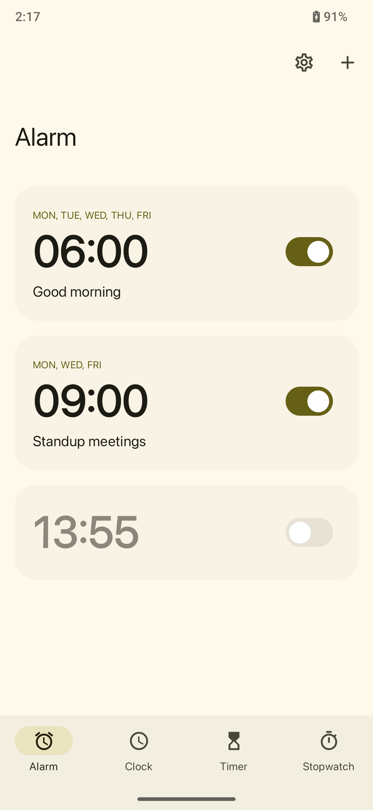
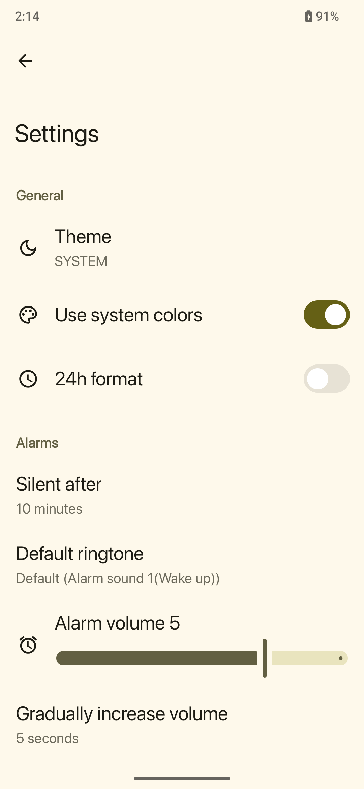

# ⏰ Android Simple Alarm

**Android Simple Alarm** is a lightweight, open-source alarm clock application for Android. It allows users to set, manage, and customize alarms with ease.

## 📱 Screenshots

<p align="center">
  
  
  
</p>

---

## 🚀 Features

- **Set Multiple Alarms**: Create and manage multiple alarms with customizable times.
- **Snooze Functionality**: Easily snooze alarms for a user-defined duration.
- **Repeat Options**: Set alarms to repeat on selected days of the week.
- **Custom Labels**: Add personalized labels to each alarm.
- **Foreground Service**: Ensures alarms ring even when the app is not active.
- **Full-Screen Alarm**: Displays a full-screen notification when the alarm rings.
- **Modern UI**: Clean and intuitive user interface following Material Design principles.

---

## 📂 Project Structure

This project uses a layered architecture inspired by **Clean Architecture** and **MVVM** pattern:

```
android-simple-alarm/
│
├── app/                      # Main application module
│   ├── activity/             # Android activities
│   ├── receiver/             # Android receivers
│   └── service/              # Android services (e.g., AlarmKlaxonService)
│
├── domain/                   # Core business logic (pure Kotlin, platform-independent)
│   ├── model/                # Data models used in domain layer
│   ├── repository/           # Interfaces for data access
│   ├── platform/             # Platform-specific interfaces (Android framework)
│   └── usecase/              # Interactors or business rules
│
├── data/                     # Implementation of repositories and data sources
│   ├── local/                # Room DB, DataStore, etc.
│   ├── system/               # Interfaces to Android system services
│   └── repository/impl/      # Actual implementations of domain repositories
│
├── presentation/             # UI logic and Android components
│   ├── alarm/                # Alarm-related screens
│   ├── ringing/              # Alarm ringing UI
│   ├── settings/             # Settings UI
│   ├── theme/                # App theming (colors, typography)
│   └── navigation/           # Compose navigation setup
```

Each layer communicates only with the layer directly beneath it via interfaces. This separation ensures modularity, reusability, and easy testing.a

---

## 🧱 Architecture & Best Practices

This project follows modern **Android development best practices** to ensure maintainability, testability, and scalability.

### 🔄 Clean Architecture

- **Layered structure**: Separates responsibilities into clear layers:
  - `domain`: Business logic (use cases, models, interfaces)
  - `data`: Data sources (Room, preferences) and their implementations
  - `presentation`: UI logic and Android components (ViewModels, Composables)

- **Dependency inversion**: High-level layers depend on abstractions, not on concrete implementations.

### 🧠 MVVM Pattern (Model-View-ViewModel)

- **ViewModel**: Handles UI-related logic and exposes reactive `StateFlow` or `LiveData`.
- **Model**: Pure Kotlin data classes representing state.
- **View (UI)**: Built with Jetpack Compose; observes ViewModel state.

### 🧪 Testable Code

- **Use cases** are pure functions (or close to it) and easy to unit test.
- **Repositories** are injected, making mocks/swaps easy for testing.
- **ViewModels** expose only state and events, not platform components.

### ⚙️ Jetpack Libraries

- `Hilt` for dependency injection
- `Room` for local data persistence
- `WorkManager` for background and delayed tasks
- `DataStore` for persistent app settings
- `Navigation-Compose` for in-app routing

### 🧩 Other Good Practices

- **Single source of truth**: Data flows one-way from source to UI.
- **Immutable UI state**: All screen states are represented by a single `data class`.
- **Unidirectional data flow**: View triggers an action → ViewModel handles it → State updates → UI re-renders.
- **Consistent naming and structure**: Easy to scale and onboard contributors.

---

## 📄 License

This project is licensed under the [MIT License](LICENSE).

---

## 📧 Contact

For any inquiries or feedback, please contact [josephdinhtan](mailto:josephdinhtan@example.com).
